# PREREQUISITES
- vcpkg
- cmake
- set environment variable VCPKG_FEATURE_FLAGS=manifests

# Multiple View Of Camera
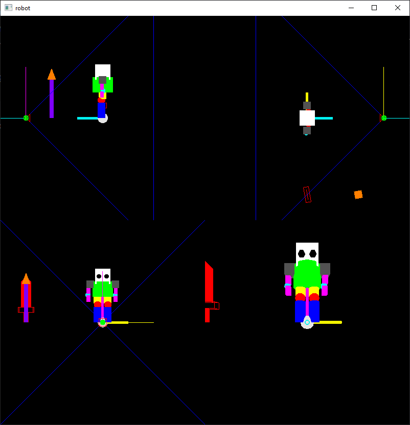
## 使用方法
+ 數字鍵0 - 同時查看4個view
+ 數字鍵1 - 從+x軸方向往起始點看
+ 數字鍵2 - 從+y軸方向往起始點看
+ 數字鍵3 - 從+z軸方向往起始點看
+ 數字鍵4 - 以相機的視角看出
+ 數字鍵+ - 從gluPerspective(default)切換到glFrustum，比較兩者差異
+ 英文鍵盤n - 將相機往正前方移動
+ 英文鍵盤f - 將相機往正後方移動  

## 成果圖
+ gluPerspective
  + 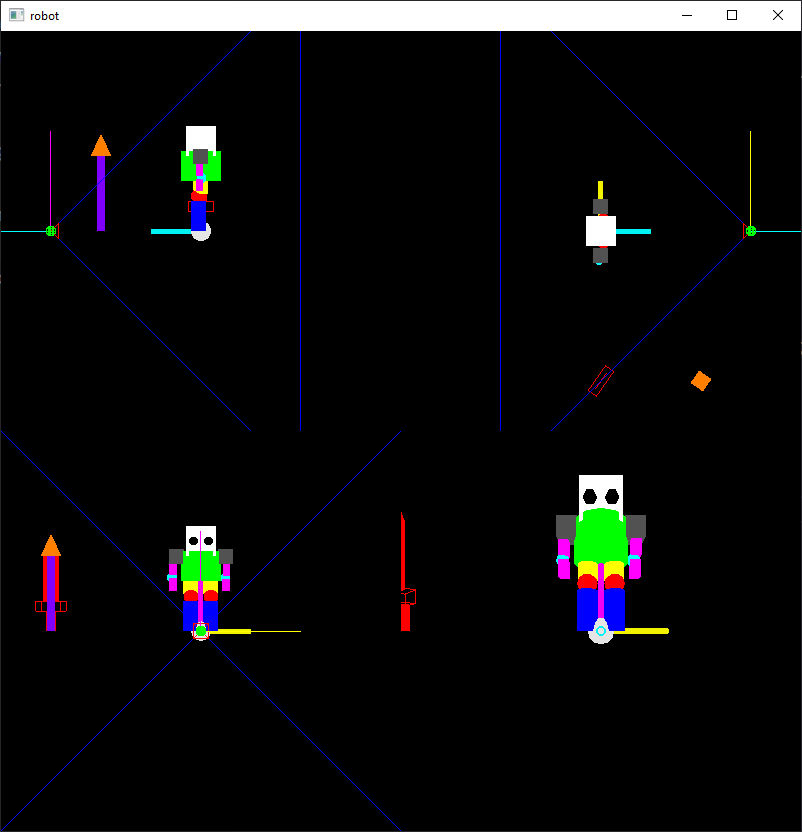
  + 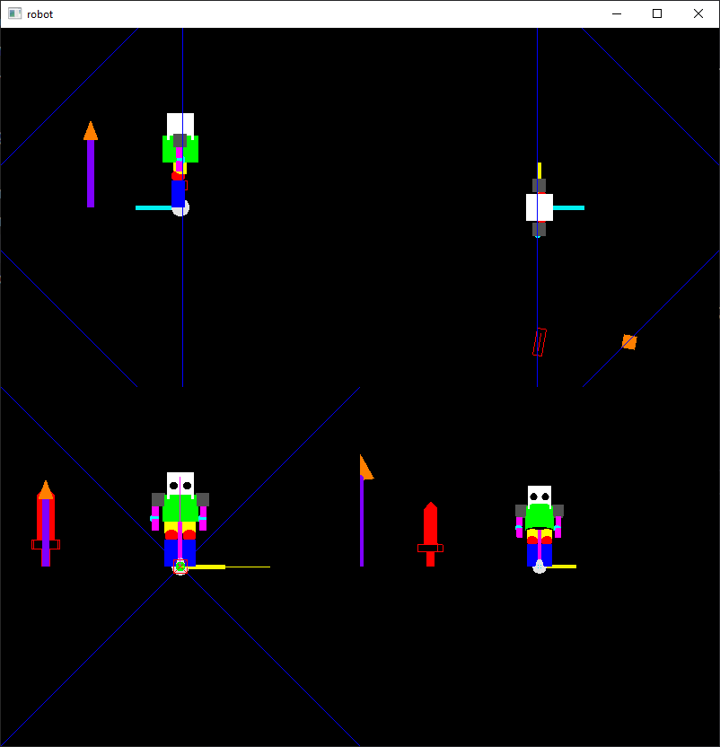
  + 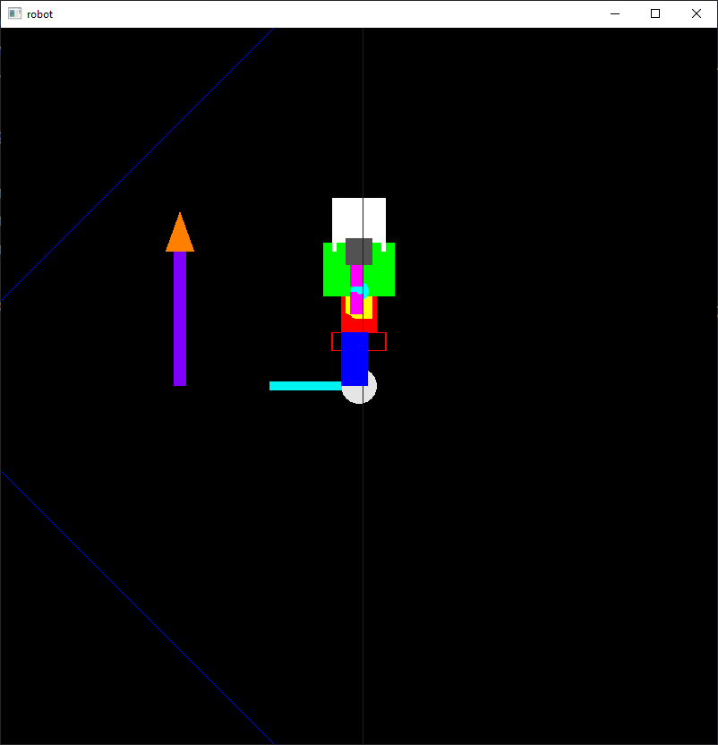
  + 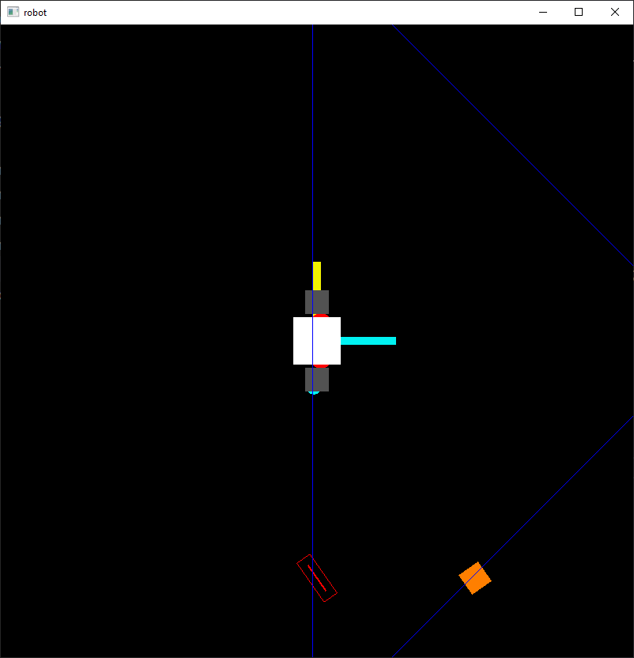
  + 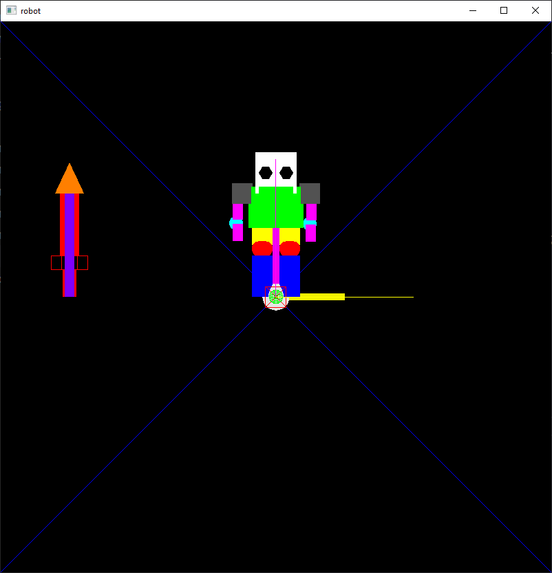
  + 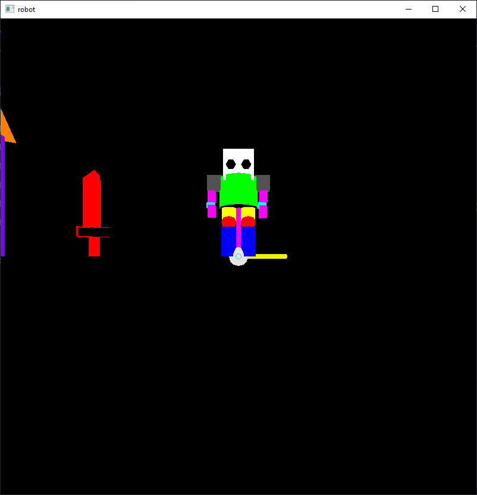  
+ glFrustum
  + 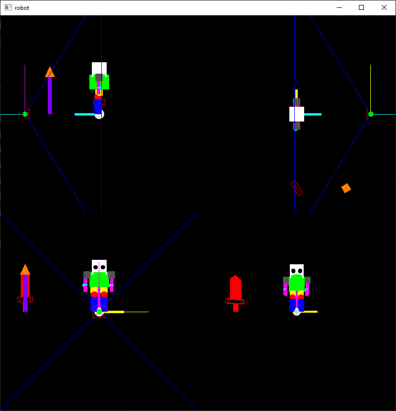
  + 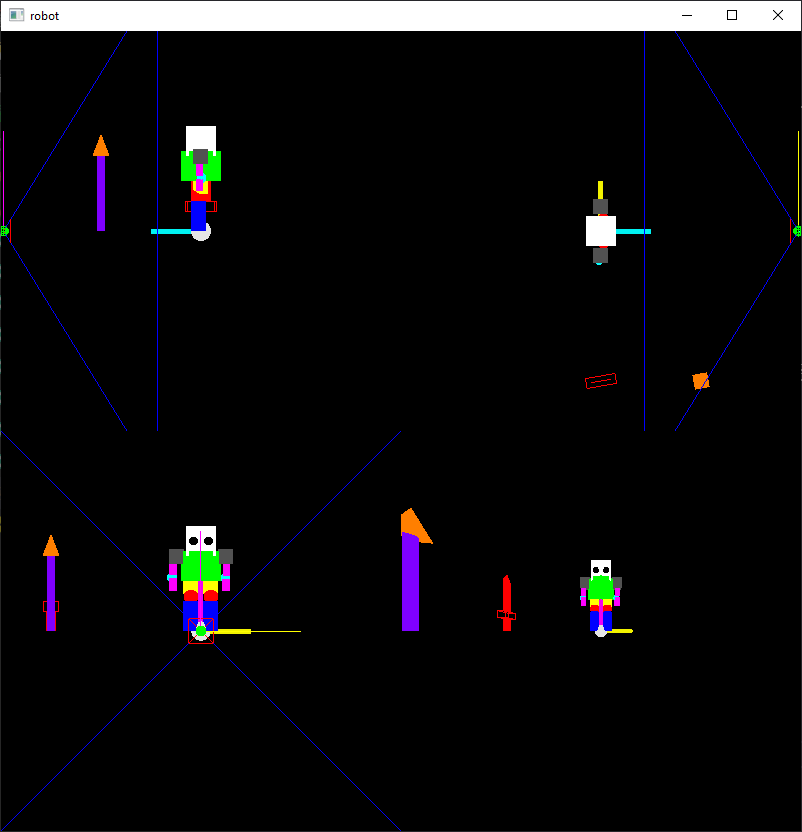
  + 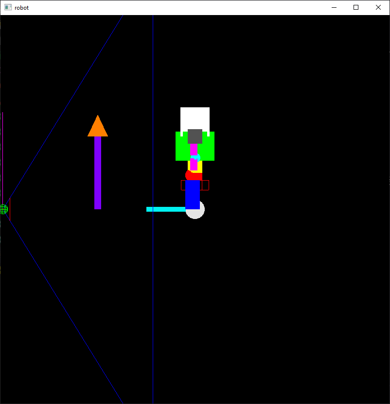
  + 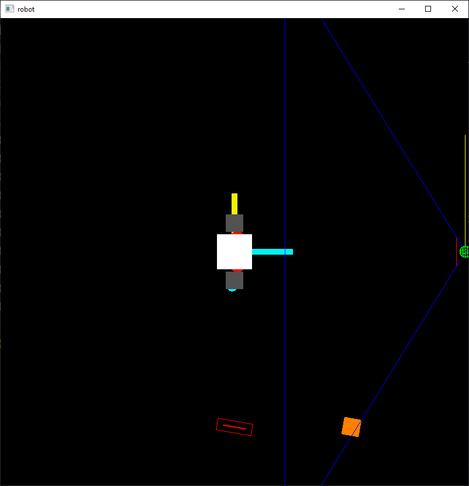
  + 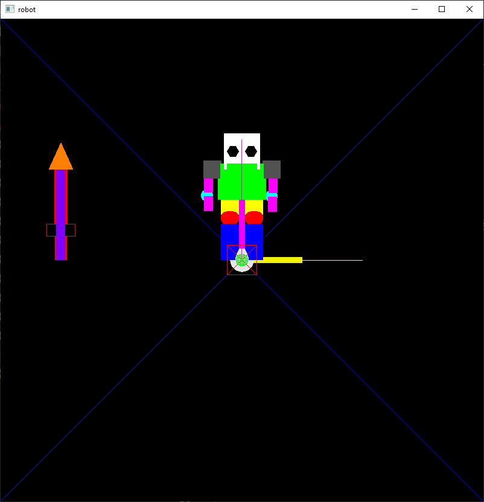
  + 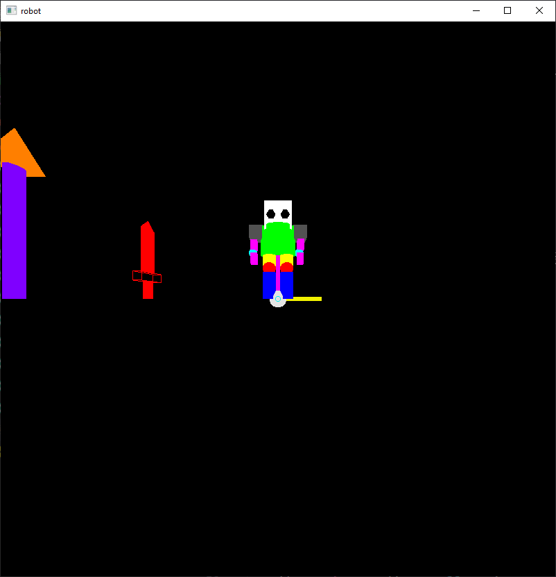